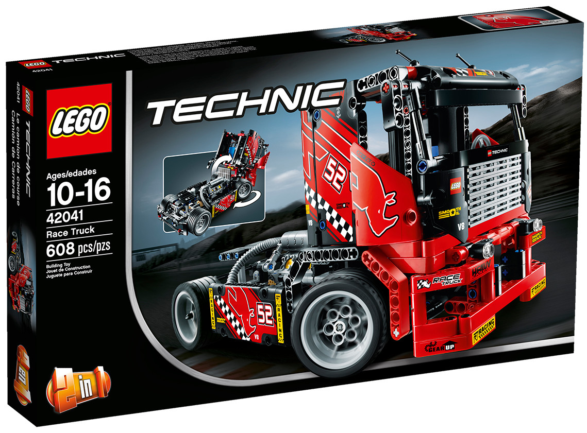
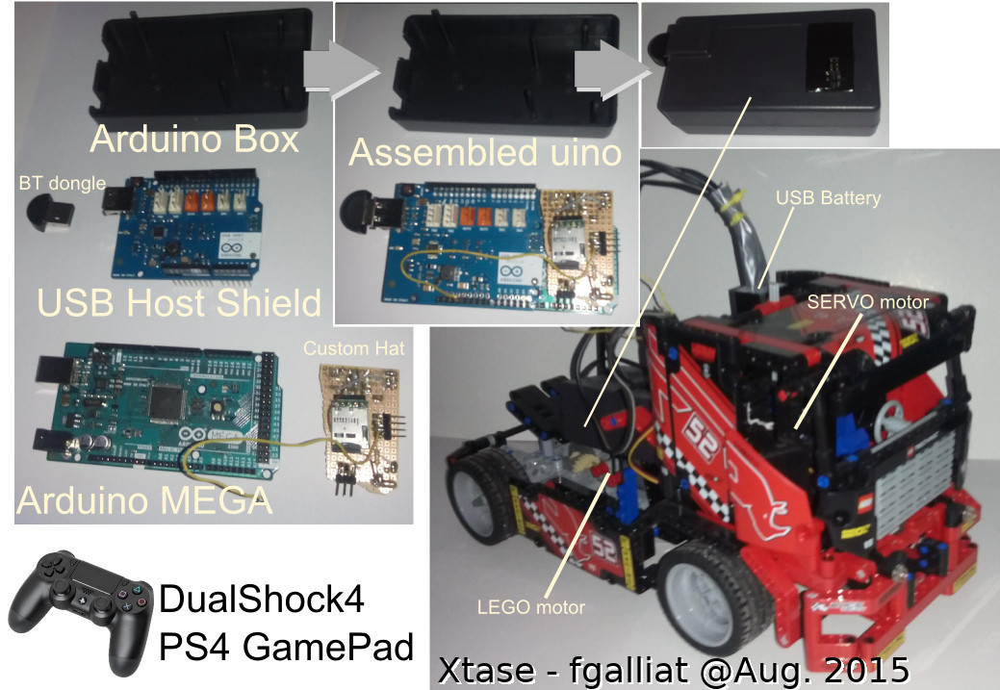

# XtsLegoTruck
Arduino + PS4 bt controller powered LEGO truck

Used an Arduino MEGA, a USB HOST SHIELD + a BT dongle
paired with a DualShock PS4 controller pad

to drive a LEGO TRUCK w/ 1engine motor & 1 steering servo-motor.

Steering Servo is an SG-90

Engine is a LEGO POWERFUNCTION medium motor

Engine driver is a MICROELECTRONIKA DCMotorClick module

MCU is an Arduino MEGA 2560 (16MHz)

The whole system is power supplied by a 5v USB battery pack.

P.S. the provided code was written in 2015 for an Arduino MEGA & is not maintained @ this day, 
any suggestions are welcome anyway...